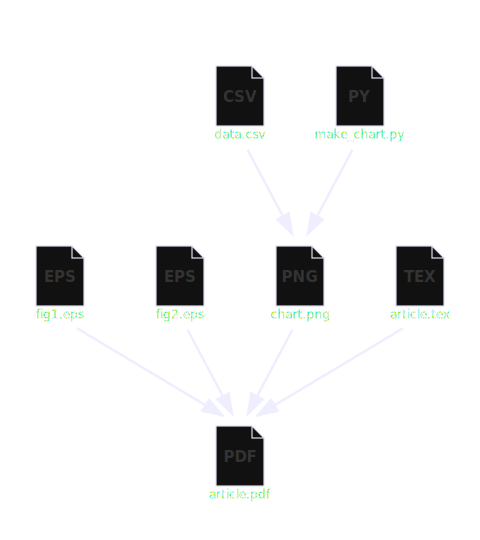

## What is a Dependence Graph?

A <b>dependence graph</b> is a diagram showing files linked by arrows.  Each arrow indicates a dependence between files, in other words: the file at the front of the arrow (called a <b>target</b>) must update whenever the file at the back of the arrow (called a <b>source</b>) changes.  Such a diagram comes in handy in many situations.  Here is an example.

Suppose you are writing a scientific journal article.  The finished article is a PDF, but that PDF is made by assembling text and visuals stored in other files.  There are figures made in a drawing program, a chart showing experimental data, and a LaTeX file describing the final product.

The directory for this project contains:

- <b>fig1.eps</b> and <b>fig2.eps</b> Technical illustrations made by an artist
- <b>data.csv</b> A spreadsheet containing raw experimental data
- <b>make_chart.py</b> A script that reads `data.csv` and uses a python library to construct <b>chart.png</b> run by typing:
```sh
python make_chart.py
```
- <b>article.tex</b> A LaTeX document containing the article's text with formatting tags and references to the figures and to the chart all describing the final product <b>article.pdf</b> which we generate by typing:
```sh
pdflatex article.tex
```

This is the dependence graph:



Recall an arrow means that the file in front needs to update when the file in back changes.  If a source file changes, following the arrows reveals what need to update in reponse.  Suppose we add more experimental data to `data.csv`, this should prompt a change to `chart.png` and that change should be incorporated into `article.pdf`.  So, we should run:

```sh
python make_chart.py
pdflatex article.tex
```

On the other hand, if our artist makes adjustments to `fig1.eps`, then we have to incorporate the new `fig1.eps` into the final pdf, but there's no need to rebuild the chart.  We just have to do this:

```sh
pdflatex article.tex
```
